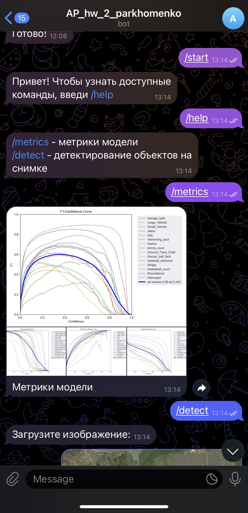
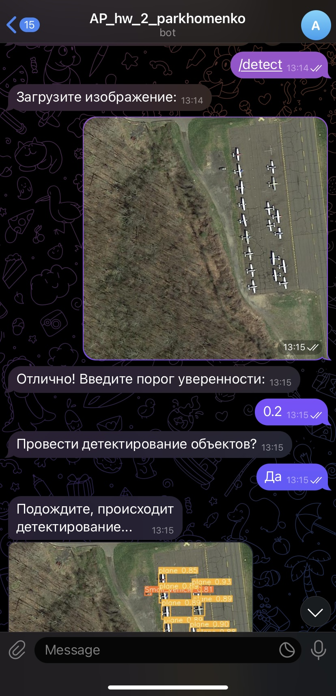
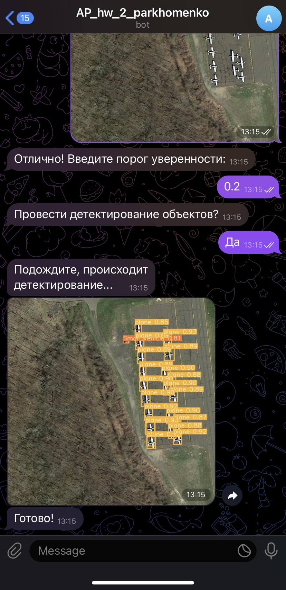
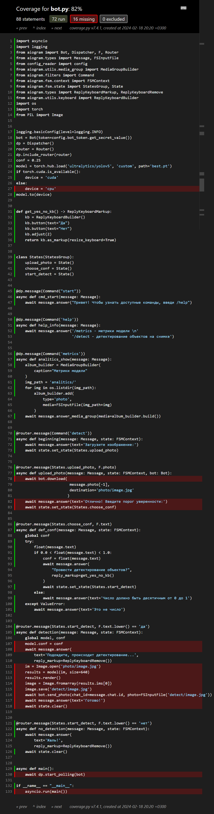

# AP_hw_3
Бот предназначен для детектирования объектов на спутниковых снимках с помощью модели yolo.

Ссылка на бота: @isaid_yolo_bot. Бот развернут только на локальной машине, потому что мощностей бесплатных сервисов ему не хватает.

В файле bot.py содержится скрипт для бота, в файле test_bot.py тесты для бота, в файле config_reader.py скрипт для чтения токена, в папке test_imgs фотографии для тестирования бота, best.pt - файл с весами модели.

Реализованы комманды /start - начало работы, /help - выводит доступные команды, /metrics - показывает метрики модели, /detect - автомат для детектирования объектов на снимках.

В папке coverage находится html файл с покрытием тестов. Покрытие составляет 82%, поскольку я не знаю, как отправить изображение для теста, и, соответсвенно, не могу протестировать 2 метода с своём боте. Ниже приведён скриншот html файла.

